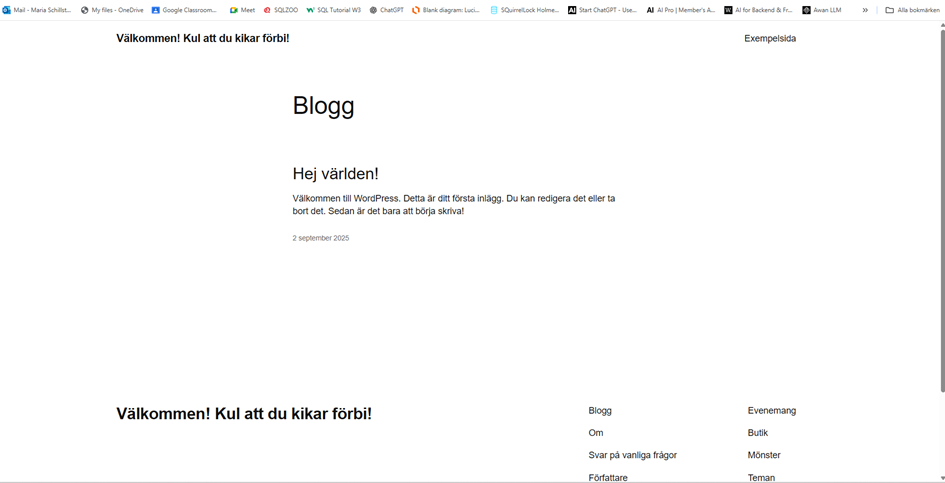

## 1. Sammanfattning (Executive summary)

**Syfte:** Bygga en robust och skalbar WordPress‑miljö på AWS med ALB + ASG (EC2 med WordPress‑AMI), RDS (databas) och EFS (media), skyddat med Security Groups.

Min approach: Till skillnad från en traditionell LAMP-stack, där databasen ligger på samma server som webbservern, valde jag att lägga databasen i en separat RDS-instans. På min EC2 körs endast Apache och PHP tillsammans med WordPress. På så sätt blir lösningen mer skalbar och följer principen om “stateless” webbnoder.

Lösningen bygger på flera AWS-tjänster : EC2, RDS, Application Load Balancer, Auto Scaling group, Cloudformation, Target Group och Iac generator.

---

## 2. Arkitektur & design


### 2.1 Översikt

**Komponentroller i korthet**

* **ALB** – tar emot trafik, gör health checks och lastbalanserar mot webbnoderna.
* **ASG + EC2** – kör Apache + PHP-FPM + WordPress (stateless noder, skalar horisontellt).
* **RDS** – MySQL-databas för WordPress (persistent data).
* **EFS** – delad lagring för `wp-content/uploads` mellan noder.
* **Security Groups** – mikroperimeter mellan ALB, webb, DB och EFS.

> **Detaljer om VPC, subnät, SG-ID, RDS-endpoint och EFS-ID finns i avsnitt *5.1 Förutsättningar*.**

### 2.2 Persistens & stateless princip

* Databas i **RDS** (ingen lokal MySQL).
* Media i **EFS** (delas mellan noder).
* **EC2** är stateless och kan ersättas via AMI + Instance Refresh.

### 2.3 Skalbarhet & tillgänglighet

* ASG över minst tre AZ\:er.
* Kapacitet exempel: **min/desired/max:** 3/3/3.
* Health checks via **ALB** (Path: `/wordpress/index.php`, HttpCode: `200‑399`).

### 2.4 Säkerhet

**SG-principen “minsta möjliga åtkomst”:**

* **ALB‑SG → Web‑SG:** HTTP 80
* **Web‑SG → RDS‑SG:** MySQL 3306
* **Web‑SG → EFS‑SG:** NFS 2049
* **SSH 22:** endast öppet från min egen IP för administration

**OS/stack:**

* SELinux aktivt; `setsebool -P httpd_can_network_connect_db 1` för DB‑åtkomst.

### 2.5 Avgränsningar

Ej med här: HTTPS/ACM, WAF, CloudFront, Secrets Manager, avancerad logging/monitoring (CloudWatch/CloudTrail/GuardDuty), CI/CD.

**Motivering:** Ej behandlat i kursmomentet, ej nödvändigt för uppgiftens kriterier G/VG; arkitekturen stödjer att lägga till detta senare.

---

## 3. Utnyttjade molntjänster

Jag skapade EC2 (WordPress), RDS och första EFS testet manuellt.

**Nätverk:** VPC, Subnets, Security Groups

**Compute:** EC2, Auto Scaling Group + Launch Template

**LB:** Application Load Balancer + Target Group

**Databas:** RDS (MySQL/Aurora)

**Lagring:** EFS

**IaC:** CloudFormation (IaC Generator)

## Hur resurserna skapades

* **Manuellt (AWS Console / SSH):**

  * EC2 för WordPress-installationen (Apache, PHP-FPM, WordPress)
  * Initialt EFS-test och montering via `amazon-efs-utils`
  * Target Group (första försöket gjordes manuellt innan IaC)

* **CloudFormation (IaC Generator):**

  * Security Groups (ALB-SG, Web-SG, RDS-SG, EFS-SG)
  * Application Load Balancer
  * Launch Template
  * Auto Scaling Group
  * RDS (MySQL 8.0)
  * EFS (slutliga implementationen)
  * Outputs (ex. ALB DNS, SG-id)

**Utdrag (SG‑YAML):**

```yaml
AlbSecurityGroup:
    Type: AWS::EC2::SecurityGroup
    Properties:
      GroupDescription: ALB ingress 80 from Internet
      VpcId: !Ref VpcId
      SecurityGroupIngress:
        - IpProtocol: tcp
          FromPort: 80
          ToPort: 80
          CidrIp: 0.0.0.0/0

  # 2) Web/ASG SG: 80 from ALB, optional SSH from MyIP
  WebSecurityGroup:
    Type: AWS::EC2::SecurityGroup
    Properties:
      GroupDescription: Web nodes behind ALB
      VpcId: !Ref VpcId
      SecurityGroupIngress:
        # HTTP only from ALB SG
        - IpProtocol: tcp
          FromPort: 80
          ToPort: 80
          SourceSecurityGroupId: !Ref AlbSecurityGroup
        # (Optional) SSH from your IP for lab
        - IpProtocol: tcp
          FromPort: 22
          ToPort: 22
          CidrIp: !Ref MyIP
```

**Utdrag (rds.yaml):**

```yaml
AWSTemplateFormatVersion: "2010-09-09"

Parameters:
  VpcSecurityGroupIds:
    Type: List<AWS::EC2::SecurityGroup::Id>
    Description: "RDS SG(s)"

  SubnetIds:
    Type: List<AWS::EC2::Subnet::Id>
    Description: "Minst två subnät i olika AZ"

  DBInstanceClass:
    Type: String
    Default: "db.t4g.micro"

  AllocatedStorage:
    Type: Number
    Default: 20

  MaxAllocatedStorage:
    Type: Number
    Default: 100

  DBName:
    Type: String
    Default: "wordpress"

  MasterUsername:
    Type: String
    Default: "admin"

  DBEngineVersion:
    Type: String
    Default: "8.0.42"

Resources:
  DBSubnetGroup:
    Type: AWS::RDS::DBSubnetGroup
    Properties:
      DBSubnetGroupDescription: "Subnets for RDS"
      SubnetIds: !Ref SubnetIds
```

## 4. Verktyg & arbetssätt

* **AWS Console & CLI**, **VS Code (Remote SSH)**, **nano, curl, mysql‑klient**
* **IaC Generator → CloudFormation (YAML + param.json)**
* **Notion & PowerPoint** för dokumentation och bilder
* **Workbench**
* **LLM** som bollplank och assistans när jag kört fast ordentligt
* **Git & GitHub** för versionshantering och delning av kod/rapporter

**param.json (varför & hur):**

* **Varför:** Separera **mall (YAML)** från **miljöspecifika värden** (t.ex. AMI‑ID, VPC, Subnets, SG). Byt bara parametrar → samma mall funkar igen.
* **Hur:** Skicka in `-parameters file://params.json` samt `-parameters file://rds-parmams.json` vid `create-stack`/`update-stack`.

**Exempel (param.json – minimal):**

```json
[
  {"ParameterKey":"VPC","ParameterValue":"vpc-0b329e02d752f8ce3"},
  {"ParameterKey":"Subnets","ParameterValue":"subnet-09d87b7e1eda77420,subnet-0ac8592636998d30c,subnet-04d9a77bb77b5b320"},
  {"ParameterKey":"AlbSecurityGroupId","ParameterValue":"sg-07ff39661c9323bd7"},
  {"ParameterKey":"WebSecurityGroupId","ParameterValue":"sg-004878a488035ebdd"},
  {"ParameterKey":"KeyName","ParameterValue":"IacTest"},
  {"ParameterKey":"InstanceType","ParameterValue":"t3.micro"},
  {"ParameterKey":"EfsId","ParameterValue":"fs-0fb9aa978c2354098"}
]
```

**Exempel (rds-param.json – minimal):**

```json
[
  [
  {"ParameterKey":"VpcSecurityGroupIds","ParameterValue":"sg-072c202d2c475594e"},
  {"ParameterKey":"SubnetIds","ParameterValue":"subnet-09d87b7e1eda77420,subnet-0ac8592636998d30c,subnet-04d9a77bb77b5b320"},
  {"ParameterKey":"DBInstanceClass","ParameterValue":"db.t4g.micro"},
  {"ParameterKey":"AllocatedStorage","ParameterValue":"20"},
  {"ParameterKey":"MaxAllocatedStorage","ParameterValue":"100"},
  {"ParameterKey":"DBName","ParameterValue":"wordpress"},
  {"ParameterKey":"MasterUsername","ParameterValue":"admin"}
]
```


## 5. Provisionering & konfiguration (steg‑för‑steg)

### 5.1 Förutsättningar

* **Region:** eu-west-1

**VPC & Subnets:**

* **VPC:** vpc-0b329e02d752f8ce3
* **Publika subnät (för ALB):**

  * subnet-058684dd8c601d55d
  * subnet-0edb1da0035dd6c8e
  * subnet-0d52fc4bf5a175abc
* **Privata subnät (för ASG/EC2):**

  * subnet-09d87b7e1eda77420
  * subnet-0ac8592636998d30c
  * subnet-04d9a77bb77b5b320

**Security Groups:**

* **ALB-SG:** sg-xxxx
* **Web-SG:** sg-xxxx
* **RDS-SG:** sg-xxxx
* **EFS-SG:** sg-xxxx

**Befintliga resurser:**

* **RDS:** database-1 (endpoint: <rds-endpoint>.eu-west-1.rds.amazonaws.com:3306)
* **EFS:** fs-04300d94d4c06ee0c6

**CLI-kommando (exempel, hämta VPC id):**

```bash
aws ec2 describe-vpcs --region eu-west-1 \
--filters "Name=isDefault,Values=true" \
--query "Vpcs[0].VpcId" --output text
```

VPC-val:
I min parameterfil (params.json) använde jag VPC vpc-0b329e02d752f8ce3 och tre subnät i olika AZ som input. Dessa låg till grund för min infrastruktur i CloudFormation.

I ett tidigare skede råkade jag skapa en ALB manuellt i AWS Console, vilket hamnade i default-VPC (vpc-0b6849c800e4a6ff1). Detta skapade en mismatch mellan ALB och övriga resurser. En ALB kan inte sträcka sig över VPC-gränser, så i en färdig lösning skulle den behöva skapas om i samma VPC som övriga resurser.

För rapporten redovisar jag därför VPC\:n från params.json, eftersom det är den parameteriserade lösningen som representerar mitt slutliga arbetssätt.

---

### 5.2 SG‑kopplingar

* **EFS‑SG:** tillåt NFS 2049 **från Web‑SG**
* **RDS‑SG:** tillåt 3306 **från Web‑SG**
* **Web‑SG:** tillåt 80 **från ALB‑SG**

**Utdrag (security-groups.yaml):**

```yaml
AWSTemplateFormatVersion: "2010-09-09"

Parameters:
  VpcId:
    Type: AWS::EC2::VPC::Id
    Description: VPC to place the security groups in
  MyIP:
    Type: String
    Default: 0.0.0.0/0         # byt till din IP/CIDR för SSH i labb
    Description: CIDR for SSH access to web nodes (use your /32 in prod)

Resources:
  # 1) ALB SG: 80 from Internet
  AlbSecurityGroup:
    Type: AWS::EC2::SecurityGroup
    Properties:
      GroupDescription: ALB ingress 80 from Internet
      VpcId: !Ref VpcId
      SecurityGroupIngress:
        - IpProtocol: tcp
          FromPort: 80
          ToPort: 80
          CidrIp: 0.0.0.0/0

  # 2) Web/ASG SG: 80 from ALB, optional SSH from MyIP
  WebSecurityGroup:
    Type: AWS::EC2::SecurityGroup
    Properties:
      GroupDescription: Web nodes behind ALB
      VpcId: !Ref VpcId
      SecurityGroupIngress:
        # HTTP only from ALB SG
        - IpProtocol: tcp
          FromPort: 80
          ToPort: 80
          SourceSecurityGroupId: !Ref AlbSecurityGroup
        # (Optional) SSH from your IP for lab
        - IpProtocol: tcp
          FromPort: 22
          ToPort: 22
          CidrIp: !Ref MyIP
```

**Snabbverifiering:**

```bash
nc -zv <rds-endpoint> 3306
nc -zv <efs-mount-target-ip> 2049
```

---

### 5.3 CloudFormation‑stack för ALB/TG/LT/ASG

**NOTE:** Templaten är modifierad från AWS, och är ett bootstrap-utkast. AMI/WordPress-flödet kommer i 5.4

**Utdrag:**

```yaml
Resources:
  EC2TargetGroup:
    Type: AWS::ElasticLoadBalancingV2::TargetGroup
    Properties:
      VpcId: !Ref VPC
      Protocol: HTTP
      Port: 80
      TargetType: instance
      HealthCheckProtocol: HTTP
      HealthCheckPath: /
      Matcher:
        HttpCode: 200-399

  LaunchTemplate:
    Type: AWS::EC2::LaunchTemplate
    Properties:
      LaunchTemplateData:
        InstanceType: t3.micro
        SecurityGroupIds: [ !Ref WebSecurityGroupId ]
        UserData:
          Fn::Base64: !Sub |
            #!/bin/bash
            dnf -y update
            dnf -y install nginx
            systemctl enable --now nginx
```

**param.json – koppling:**

```bash
aws cloudformation create-stack \
  --stack-name main-infra-pre-ami \
  --region eu-west-1 \
  --template-body file://main-infra.yaml \
  --parameters file://param.json

# …eller update-stack vid ändringar
```

---

### 5.4 Bygg WordPress-grund på fristående EC2 → skapa AMI för ASG

Jag valde att skapa en fristående EC2 som jag installerade WordPress på enligt nedan. Därefter skapade jag en AMI till launchtemplate för att få WP till mina noder i ASG.

#### Förutsättningar

* En **RDS MySQL** finns och är *available*
* **RDS-SG** tillåter inbound `3306` från **Web-SG**
* Du har **Public DNS/IP** till din EC2

#### 5.4.1 Starta EC2 + Security Groups

1. Skapa en EC2 med **Amazon Linux 2023** (t.ex. `t3.small`)
2. Security Group för EC2 (Web):

   * `SSH 22` från din IP
   * `HTTP 80` från `0.0.0.0/0` (för test)
3. Spara PEM-nyckeln och SSH\:a in som `ec2-user`

#### 5.4.2 Installera paket

```bash
sudo dnf update -y
sudo dnf install -y httpd php php-mysqlnd php-fpm php-json php-gd php-xml php-mbstring wget unzip mariadb105
```

#### 5.4.3 Starta tjänster

```bash
sudo systemctl enable --now httpd php-fpm
```

#### 5.4.5 Koppla Apache → PHP-FPM

Skapa `/etc/httpd/conf.d/php.conf`:

```bash
sudo tee /etc/httpd/conf.d/php.conf >/dev/null <<'EOF'
<FilesMatch \.php$>
  SetHandler "proxy:unix:/run/php-fpm/www.sock|fcgi://localhost/"
</FilesMatch>
DirectoryIndex index.php
EOF

sudo systemctl restart httpd
```

Justera `/etc/php-fpm.d/www.conf` (relevanta rader):

```ini
user = apache
group = apache
listen = /run/php-fpm/www.sock
listen.owner = apache
listen.group = apache
listen.mode = 0660
```

```bash
sudo systemctl restart php-fpm httpd
```

#### 5.4.6 Lägg in WordPress

```bash
cd /tmp
wget https://wordpress.org/latest.zip
unzip latest.zip
sudo mv wordpress /var/www/html/
sudo chown -R apache:apache /var/www/html/wordpress
sudo chmod -R 755 /var/www/html/wordpress
```

#### 5.4.7 Koppla mot RDS (wp-config.php)

```bash
sudo cp /var/www/html/wordpress/wp-config-sample.php /var/www/html/wordpress/wp-config.php
sudo nano /var/www/html/wordpress/wp-config.php
```

Ändra rader:

```php
define( 'DB_NAME',     '<DB_NAME>' );
define( 'DB_USER',     '<DB_USER>' );
define( 'DB_PASSWORD', '<DB_PASSWORD>' );
define( 'DB_HOST',     '<RDS_ENDPOINT>:3306' );
```

#### 5.4.8 Tillåt DB-trafik (SELinux)

```bash
sudo setsebool -P httpd_can_network_connect_db 1
```

#### 5.4.9 Verifiera & slutför WP-installationen

Öppna: `http://<EC2_PUBLIC_DNS>/wordpress/`



✅ Resultat: WordPress körs på en fristående EC2 kopplad till RDS.

---

### 5.5 Skapa AMI och rulla ut via ASG

#### 5.5.1 Skapa AMI från din fungerande EC2

* EC2 Console → Instances → markera din WP-EC2 →
  Actions → Image and templates → Create image
* **Name:** wp-ami-<YYYYMMDD>
* **Reboot:** ikryssad
* Vänta tills status = available och notera AMI-ID

#### 5.5.2 Skapa ny Launch Template-version

* Gå till Launch Templates → Create new version
* **AMI:** välj ditt nya AMI-ID
* **Instance type / Key pair / SG:** samma som tidigare
* **UserData:** lämnas tomt (ingen bootstrap som krockar med AMI-innehållet)
* Sätt som **Default version**

```yaml
AWSTemplateFormatVersion: "2010-09-09"

Parameters:
  AmiId:
    Type: String
    Description: "AMI to use for WordPress nodes (your golden AMI)"
    Default: ami-03ebbd71503bf5fed  # <-- byt vid behov
  VPC:
    Type: AWS::EC2::VPC::Id
  Subnets:
    Type: List<AWS::EC2::Subnet::Id>
  AlbSecurityGroupId:
    Type: AWS::EC2::SecurityGroup::Id
  WebSecurityGroupId:
    Type: AWS::EC2::SecurityGroup::Id
  KeyName:
    Type: AWS::EC2::KeyPair::KeyName
  InstanceType:
    Type: String
    Default: t3.micro
    AllowedValues: [ t3.micro, t3.small, t3.medium ]

Resources:
  EC2TargetGroup:
    Type: AWS::ElasticLoadBalancingV2::TargetGroup
    Properties:
      VpcId: !Ref VPC
      Protocol: HTTP
      Port: 80
      TargetType: instance
      HealthCheckProtocol: HTTP
      HealthCheckPath: /wordpress/index.php
      Matcher:
        HttpCode: 200-399
      HealthCheckIntervalSeconds: 60
      HealthCheckTimeoutSeconds: 30
      HealthyThresholdCount: 3
      UnhealthyThresholdCount: 5

  ApplicationLoadBalancer:
    Type: AWS::ElasticLoadBalancingV2::LoadBalancer
    Properties:
      Scheme: internet-facing
      Type: application
      Subnets: !Ref Subnets
      SecurityGroups: [ !Ref AlbSecurityGroupId ]

  ALBListener:
    Type: AWS::ElasticLoadBalancingV2::Listener
    Properties:
      LoadBalancerArn: !Ref ApplicationLoadBalancer
      Port: 80
      Protocol: HTTP
      DefaultActions:
        - Type: forward
          TargetGroupArn: !Ref EC2TargetGroup

  LaunchTemplate:
    Type: AWS::EC2::LaunchTemplate
    Properties:
      LaunchTemplateName: !Sub ${AWS::StackName}-lt
      LaunchTemplateData:
        ImageId: !Ref AmiId
        InstanceType: !Ref InstanceType
        KeyName: !Ref KeyName
        SecurityGroupIds:
          - !Ref WebSecurityGroupId
        # Ingen UserData här – allt finns i AMI:t

  WebServerGroup:
    Type: AWS::AutoScaling::AutoScalingGroup
    Properties:
      VPCZoneIdentifier: !Ref Subnets
      LaunchTemplate:
        LaunchTemplateId: !Ref LaunchTemplate
        Version: !GetAtt LaunchTemplate.LatestVersionNumber
      MinSize: "3"
      DesiredCapacity: "3"
      MaxSize: "3"
      TargetGroupARNs:
        - !Ref EC2TargetGroup
      HealthCheckType: ELB
      HealthCheckGracePeriod: 180
      Tags:
        - Key: Name
          Value: wp-web-node
          PropagateAtLaunch: true

Outputs:
  AlbDNS:
    Value: !GetAtt ApplicationLoadBalancer.DNSName
    Description: "ALB DNS name"
```

```yaml
InstanceRefresh:
  Preferences:
    MinHealthyPercentage: 100
    InstanceWarmup: 90
  Triggers:
    - LaunchTemplate
```

#### 5.5.3 Peka ASG till nya LT-versionen + Instance Refresh

* Auto Scaling Groups → välj din ASG
* Kontrollera att ASG använder **Default version** (nya LT)
* Starta Instance Refresh

#### 5.5.4 Verifiera

* Kontrollera Target Group: alla instanser ska vara *healthy*
* Öppna: `http://<ALB_DNS>/wordpress/` → WordPress ska ladda


## 5.5 RDS – databas för WordPress (MANUELLT → därefter IaC)

### 5.5.1 Provisionering via CloudFormation

Jag satte först upp EFS manuellt, för att sedan exportera/återskapa via IaC Generator.

**YAML-mall (rds.yaml):**

```yaml
AWSTemplateFormatVersion: "2010-09-09"

Parameters:
  VpcSecurityGroupIds:
    Type: List<AWS::EC2::SecurityGroup::Id>
    Description: "RDS SG(s)"

  SubnetIds:
    Type: List<AWS::EC2::Subnet::Id>
    Description: "Minst två subnät i olika AZ"

  DBInstanceClass:
    Type: String
    Default: "db.t4g.micro"

  AllocatedStorage:
    Type: Number
    Default: 20

  MaxAllocatedStorage:
    Type: Number
    Default: 100

  DBName:
    Type: String
    Default: "wordpress"

  MasterUsername:
    Type: String
    Default: "admin"

  DBEngineVersion:
    Type: String
    Default: "8.0.42"

Resources:
  DBSubnetGroup:
    Type: AWS::RDS::DBSubnetGroup
    Properties:
      DBSubnetGroupDescription: "Subnets for RDS"
      SubnetIds: !Ref SubnetIds

  MyDB:
    Type: AWS::RDS::DBInstance
    DeletionPolicy: Delete
    UpdateReplacePolicy: Delete
    Properties:
      Engine: mysql
      EngineVersion: !Ref DBEngineVersion
      DBInstanceClass: !Ref DBInstanceClass
      AllocatedStorage: !Ref AllocatedStorage
      MaxAllocatedStorage: !Ref MaxAllocatedStorage
      StorageType: gp2
      StorageEncrypted: true
      MultiAZ: false
      PubliclyAccessible: true
      AutoMinorVersionUpgrade: true
      CopyTagsToSnapshot: true
      BackupRetentionPeriod: 0
      DBSubnetGroupName: !Ref DBSubnetGroup
      VPCSecurityGroups: !Ref VpcSecurityGroupIds
      DBName: !Ref DBName
      MasterUsername: !Ref MasterUsername
      ManageMasterUserPassword: true

Outputs:
  DBEndpointAddress:
    Value: !GetAtt MyDB.Endpoint.Address
  DBSecretArn:
    Value: !GetAtt MyDB.MasterUserSecret.SecretArn
```

**Parameterfil (rds-params.json):**

```json
[
  {"ParameterKey":"VpcSecurityGroupIds","ParameterValue":"sg-072c202d2c475594e"},
  {"ParameterKey":"SubnetIds","ParameterValue":"subnet-09d87b7e1eda77420,subnet-0ac8592636998d30c,subnet-04d9a77bb77b5b320"},
  {"ParameterKey":"DBInstanceClass","ParameterValue":"db.t4g.micro"},
  {"ParameterKey":"AllocatedStorage","ParameterValue":"20"},
  {"ParameterKey":"MaxAllocatedStorage","ParameterValue":"100"},
  {"ParameterKey":"DBName","ParameterValue":"wordpress"},
  {"ParameterKey":"MasterUsername","ParameterValue":"admin"}
]
```

**Kommando för att skapa stacken:**

```bash
aws cloudformation create-stack \
  --stack-name rds-wp \
  --template-body file://rds.yaml \
  --parameters file://rds-params.json \
  --capabilities CAPABILITY_NAMED_IAM
```

### 5.5.2 Problem & lösning – Security Groups

När jag satte upp RDS fungerade inte anslutningen till MySQL Workbench direkt, trots att databasen hade en Security Group kopplad.

* **Orsak:** Regeln i SG var en SG→SG-regel (släpper bara in trafik från andra resurser i AWS). Min dator ansluter via publik IP och blockerades därför.
* **Lösning:** Jag lade till en inbound-regel på port 3306 för min publika IP/32. Därefter fungerade anslutningen.
* **Framåt:** Detta kan lösas direkt i CloudFormation med en parameter för administratörens IP-adress, i stället för manuell ändring.

### 5.5.3 Verifiering

* **Secrets Manager:** Lösen lagras automatiskt där p.g.a. `ManageMasterUserPassword = true`.
* **Workbench:** Anslut via RDS-endpoint, port 3306, användarnamn `admin`, lösenord från Secrets Manager.

 Resultat: En fungerande RDS MySQL-instans för WordPress.

[Workbench](Images/Workbench.png)

---

## 5.6 EFS för media (MANUELLT → därefter IaC)

Jag satte först upp EFS manuellt, för att sedan exportera/återskapa via IaC Generator.

```bash
sudo mkdir -p /mnt/efs
sudo mount -t efs -o tls <efs-id>:/ /mnt/efs
sudo mkdir -p /mnt/efs/wp-uploads
sudo rsync -a /var/www/html/wordpress/wp-content/uploads/ /mnt/efs/wp-uploads/
sudo mv /var/www/html/wordpress/wp-content/uploads /var/www/html/wordpress/wp-content/uploads.bak
sudo ln -s /mnt/efs/wp-uploads /var/www/html/wordpress/wp-content/uploads
# fstab
 echo "<efs-id>:/ /mnt/efs efs tls,_netdev 0 0" | sudo tee -a /etc/fstab
```

**Notis:** *EFS sattes först upp manuellt. Därefter exporterades via IaC Generator till en CloudFormation-mall.*

**Utkast (EFS1.yaml):**

AWSTemplateFormatVersion: "2010-09-09"

```
Parameters:
  VPC:
    Type: AWS::EC2::VPC::Id
  Subnets:
    Type: List<AWS::EC2::Subnet::Id>
  AlbSecurityGroupId:
    Type: AWS::EC2::SecurityGroup::Id
  WebSecurityGroupId:
    Type: AWS::EC2::SecurityGroup::Id
  KeyName:
    Type: AWS::EC2::KeyPair::KeyName
  InstanceType:
    Type: String
    Default: t3.micro
    AllowedValues: [t3.micro, t3.small, t3.medium]
  LatestAmiId:
    Type: "AWS::SSM::Parameter::Value<AWS::EC2::Image::Id>"
    Default: "/aws/service/ami-amazon-linux-latest/al2023-ami-kernel-default-x86_64"

Resources:
  EC2TargetGroup:
    Type: AWS::ElasticLoadBalancingV2::TargetGroup
    Properties:
      VpcId: !Ref VPC
      Protocol: HTTP
      Port: 80
      TargetType: instance
      HealthCheckProtocol: HTTP
      HealthCheckPath: /healthz.html
      Matcher: { HttpCode: "200-399" }

  ApplicationLoadBalancer:
    Type: AWS::ElasticLoadBalancingV2::LoadBalancer
    Properties:
      Scheme: internet-facing
      Type: application
      Subnets: !Ref Subnets
      SecurityGroups: [ !Ref AlbSecurityGroupId ]

  ALBListener:
    Type: AWS::ElasticLoadBalancingV2::Listener
    Properties:
      LoadBalancerArn: !Ref ApplicationLoadBalancer
      Port: 80
      Protocol: HTTP
      DefaultActions:
        - Type: forward
          TargetGroupArn: !Ref EC2TargetGroup


```


---

## 6. Drift, uppdatering & rollback (kursnivå)

* **Ny version:** ändra på fristående EC2 → skapa **ny AMI** → uppdatera **AmiId** → **Instance Refresh**.
* **Rollback:** peka tillbaka `AmiId` till föregående AMI → ny **Instance Refresh**.

---

## 7. Felsökning (kort)

* **504 från ALB:** kontrollera RDS-SG (3306 från Web-SG), TG-timeout, HealthCheckPath.
* **500 lokalt:** PHP-FPM saknas/fel socket-ägare (se 5.4).
* **404 på `info.php`:** filen inte i `/var/www/html`.
* **Git Bash path-conversion:** använd PowerShell eller `MSYS_NO_PATHCONV=1`.

---

## 8. Reflektion & fortsatt arbete

* Lägg till **HTTPS/ACM**, **WAF**, autoscaling-policys, **backup/restore-rutiner** för RDS/EFS, och **CI/CD** för AMI-byggen när kursmomenten täcker detta.

---

**Snabbverifiering:**

```bash
nc -zv <rds-endpoint> 3306
nc -zv <efs-mount-target-ip> 2049
```


