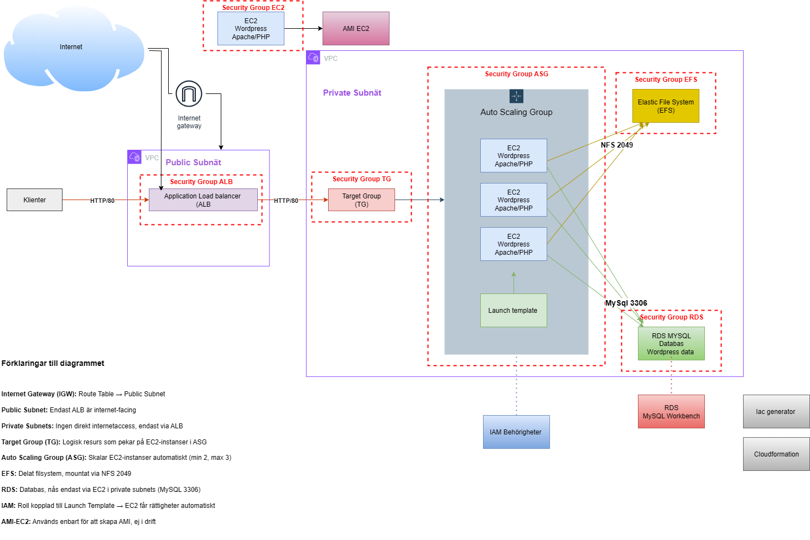
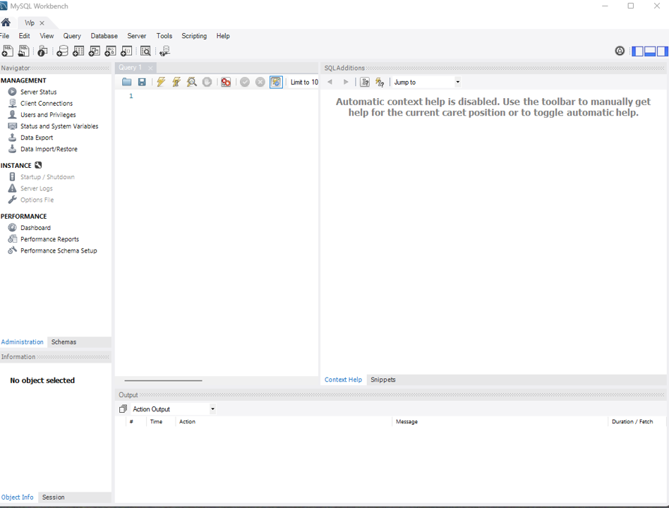

# WordPress AWS Infrastructure Assignment  

### Maria Schillström  
### Kurs: Skalbara molnapplikationer  
### Datum: 2025-09-10  

<div class="page"/>


- [WordPress AWS Infrastructure Assignment](#wordpress-aws-infrastructure-assignment)
    - [Maria Schillström](#maria-schillström)
    - [Kurs: Skalbara molnapplikationer](#kurs-skalbara-molnapplikationer)
    - [Datum: 2025-09-10](#datum-2025-09-10)
  - [1. Sammanfattning (Executive summary)](#1-sammanfattning-executive-summary)
  - [2. Arkitektur \& design](#2-arkitektur--design)
    - [2.1 Översikt](#21-översikt)
    - [2.2 Persistens \& stateless princip](#22-persistens--stateless-princip)
    - [2.3 Skalbarhet \& tillgänglighet](#23-skalbarhet--tillgänglighet)
    - [2.4 Säkerhet](#24-säkerhet)
    - [2.5 Avgränsningar](#25-avgränsningar)
  - [3. Utnyttjade molntjänster](#3-utnyttjade-molntjänster)
    - [Hur resurserna skapades](#hur-resurserna-skapades)
  - [4. Verktyg \& arbetssätt](#4-verktyg--arbetssätt)
  - [5. Provisionering \& konfiguration (steg-för-steg)](#5-provisionering--konfiguration-steg-för-steg)
    - [5.1 Förutsättningar](#51-förutsättningar)
    - [5.2 SG-kopplingar](#52-sg-kopplingar)
    - [5.3 CloudFormation-stack för ALB/TG/LT/ASG](#53-cloudformation-stack-för-albtgltasg)
    - [5.4 Bygg WordPress-grund på fristående EC2 → skapa AMI för ASG](#54-bygg-wordpress-grund-på-fristående-ec2--skapa-ami-för-asg)
      - [Förutsättningar](#förutsättningar)
      - [5.4.1 Starta EC2 + Security Groups](#541-starta-ec2--security-groups)
      - [5.4.2 Installera paket](#542-installera-paket)
      - [5.4.3 Starta tjänster](#543-starta-tjänster)
      - [5.4.5 Koppla Apache → PHP-FPM](#545-koppla-apache--php-fpm)
      - [5.4.6 Lägg in WordPress](#546-lägg-in-wordpress)
      - [5.4.7 Koppla mot RDS (wp-config.php)](#547-koppla-mot-rds-wp-configphp)
      - [5.4.8 Tillåt DB-trafik (SELinux)](#548-tillåt-db-trafik-selinux)
      - [5.4.9 Verifiera \& slutför WP-installationen](#549-verifiera--slutför-wp-installationen)
    - [5.5 Skapa AMI och rulla ut via ASG](#55-skapa-ami-och-rulla-ut-via-asg)
      - [5.5.1 Skapa AMI från din fungerande EC2](#551-skapa-ami-från-din-fungerande-ec2)
      - [5.5.2 Skapa ny Launch Template-version](#552-skapa-ny-launch-template-version)
      - [5.5.3 Peka ASG till nya LT-versionen + Instance Refresh](#553-peka-asg-till-nya-lt-versionen--instance-refresh)
      - [5.5.4 Verifiera](#554-verifiera)
  - [6.0 RDS – databas för WordPress (MANUELLT → därefter IaC)](#60-rds--databas-för-wordpress-manuellt--därefter-iac)
    - [6.1 Provisionering via CloudFormation](#61-provisionering-via-cloudformation)
    - [7 Problem \& lösning – Security Groups](#7-problem--lösning--security-groups)
    - [7.1 Verifiering](#71-verifiering)
  - [8 EFS för media (MANUELLT → därefter IaC)](#8-efs-för-media-manuellt--därefter-iac)
  - [9. Drift, uppdatering \& rollback](#9-drift-uppdatering--rollback)
  - [10. Felsökning (kort)](#10-felsökning-kort)
  - [11. Reflektion](#11-reflektion)
    - [Om jag fick göra om](#om-jag-fick-göra-om)
    - [Lägg till i framtiden](#lägg-till-i-framtiden)
  - [12. Kompletta CloudFormation-skript använda](#12-kompletta-cloudformation-skript-använda)
  - [13. Skapa CloudFormation via Iac generator (Exempel RDS)](#13-skapa-cloudformation-via-iac-generator-exempel-rds)
    - [Skapa en RDS-databas (MySQL)](#skapa-en-rds-databas-mysql)
    - [Steg-för-steg (Bild 1–7)](#steg-för-steg-bild-17)
    - [Skapa en CloudFormation via Iac generator](#skapa-en-cloudformation-via-iac-generator)

<div style="page-break-after: always;"></div>


## 1. Sammanfattning (Executive summary)

**Syfte:** Bygga en robust och skalbar WordPress-miljö på AWS med ALB + ASG (EC2 med WordPress-AMI), RDS (databas) och EFS (media), skyddat med Security Groups.

Min approach utgick från att skapa en lösning som är robust, skalbar och följer best practice inom molninfrastruktur. Istället för att köra hela WordPress-miljön på en enda EC2-instans (en klassisk LAMP-stack), valde jag att separera komponenterna: databasen i en hanterad RDS-tjänst, media i EFS och själva WordPress-koden i stateless EC2-instanser bakom en ALB. På så sätt kan varje del skötas, skala och säkras på sitt håll.

Målet var inte bara att få igång WordPress, utan att bygga en grund som kan växa — där det är enkelt att byta ut eller skala upp enskilda delar utan att störa helheten. Lösningen jag byggt är enklare än en full produktionsmiljö, men följer samma principer och kan byggas vidare med t.ex. WAF, HTTPS och CI/CD i framtiden.

<div class="page"/>

## 2. Arkitektur & design



### 2.1 Översikt

**Komponentroller i korthet**

- **ALB** – tar emot trafik, gör health checks och lastbalanserar mot webbnoderna.  
- **ASG + EC2** – kör Apache + PHP-FPM + WordPress (stateless noder, skalar horisontellt).  
- **RDS** – MySQL-databas för WordPress (persistent data).  
- **EFS** – delad lagring för `wp-content/uploads` mellan noder.  
- **Security Groups** – mikroperimeter mellan ALB, webb, DB och EFS.  

> **Detaljer om VPC, subnät, SG-ID, RDS-endpoint och EFS-ID finns i avsnitt *5.1 Förutsättningar*.**

### 2.2 Persistens & stateless princip

- Databas i **RDS** (ingen lokal MySQL).  
- Media i **EFS** (delas mellan noder).  
- **EC2** är stateless och kan ersättas via AMI + Instance Refresh.  

### 2.3 Skalbarhet & tillgänglighet

- ASG över minst tre AZ:er.  
- Kapacitet exempel: **min/desired/max = 3/3/3**.  
- Health checks via **ALB** (Path: `/wordpress/index.php`, HttpCode: `200-399`).  

### 2.4 Säkerhet

**SG-principen “minsta möjliga åtkomst”:**

- **ALB-SG → Web-SG:** HTTP 80  
- **Web-SG → RDS-SG:** MySQL 3306  
- **Web-SG → EFS-SG:** NFS 2049  
- **SSH 22:** endast öppet från min egen IP för administration  

**OS/stack:**

- SELinux aktivt; `setsebool -P httpd_can_network_connect_db 1` för DB-åtkomst.  

### 2.5 Avgränsningar

Ej med här: HTTPS/ACM, WAF, CloudFront, Secrets Manager, avancerad logging/monitoring (CloudWatch/CloudTrail/GuardDuty), CI/CD.  

**Motivering:** Ej behandlat i kursmomentet, ej nödvändigt för uppgiftens kriterier G/VG; arkitekturen stödjer att lägga till detta senare.  

<div class="page"/>


<div class="page"/>

## 3. Utnyttjade molntjänster

Jag skapade EC2 (WordPress), RDS och första EFS-testet manuellt.

- **Nätverk:** VPC, Subnets, Security Groups  
- **Compute:** EC2, Auto Scaling Group + Launch Template  
- **LB:** Application Load Balancer + Target Group  
- **Databas:** RDS (MySQL/Aurora)  
- **Lagring:** EFS  
- **IaC:** CloudFormation (IaC Generator)  

### Hur resurserna skapades

- **Manuellt (AWS Console / SSH):**  
  - EC2 för WordPress-installationen (Apache, PHP-FPM, WordPress)  
  - Initialt EFS-test och montering via `amazon-efs-utils`  
  - Target Group (första försöket gjordes manuellt innan IaC)  

- **CloudFormation (IaC Generator):**  
  - Security Groups (ALB-SG, Web-SG, RDS-SG, EFS-SG)  
  - Application Load Balancer  
  - Launch Template  
  - Auto Scaling Group  
  - RDS (MySQL 8.0)  
  - EFS (slutliga implementationen)  
  - Outputs (ex. ALB DNS, SG-id)  

**Utdrag (SG-YAML):**

```yaml
AlbSecurityGroup:
    Type: AWS::EC2::SecurityGroup
    Properties:
      GroupDescription: ALB ingress 80 from Internet
      VpcId: !Ref VpcId
      SecurityGroupIngress:
        - IpProtocol: tcp
          FromPort: 80
          ToPort: 80
          CidrIp: 0.0.0.0/0

  # 2) Web/ASG SG: 80 from ALB, optional SSH from MyIP
  WebSecurityGroup:
    Type: AWS::EC2::SecurityGroup
    Properties:
      GroupDescription: Web nodes behind ALB
      VpcId: !Ref VpcId
      SecurityGroupIngress:
        # HTTP only from ALB SG
        - IpProtocol: tcp
          FromPort: 80
          ToPort: 80
          SourceSecurityGroupId: !Ref AlbSecurityGroup
        # (Optional) SSH from your IP for lab
        - IpProtocol: tcp
          FromPort: 22
          ToPort: 22
          CidrIp: !Ref MyIP
 

**Utdrag (SG-YAML):**

```yaml
AlbSecurityGroup:
    Type: AWS::EC2::SecurityGroup
    Properties:
      GroupDescription: ALB ingress 80 from Internet
      VpcId: !Ref VpcId
      SecurityGroupIngress:
        - IpProtocol: tcp
          FromPort: 80
          ToPort: 80
          CidrIp: 0.0.0.0/0

  # 2) Web/ASG SG: 80 from ALB, optional SSH from MyIP
  WebSecurityGroup:
    Type: AWS::EC2::SecurityGroup
    Properties:
      GroupDescription: Web nodes behind ALB
      VpcId: !Ref VpcId
      SecurityGroupIngress:
        # HTTP only from ALB SG
        - IpProtocol: tcp
          FromPort: 80
          ToPort: 80
          SourceSecurityGroupId: !Ref AlbSecurityGroup
        # (Optional) SSH from your IP for lab
        - IpProtocol: tcp
          FromPort: 22
          ToPort: 22
          CidrIp: !Ref MyIP
```

**Utdrag (rds.yaml):**

```yaml
AWSTemplateFormatVersion: "2010-09-09"

Parameters:
  VpcSecurityGroupIds:
    Type: List<AWS::EC2::SecurityGroup::Id>
    Description: "RDS SG(s)"

  SubnetIds:
    Type: List<AWS::EC2::Subnet::Id>
    Description: "Minst två subnät i olika AZ"

  DBInstanceClass:
    Type: String
    Default: "db.t4g.micro"

  AllocatedStorage:
    Type: Number
    Default: 20

  MaxAllocatedStorage:
    Type: Number
    Default: 100

  DBName:
    Type: String
    Default: "wordpress"

  MasterUsername:
    Type: String
    Default: "admin"

  DBEngineVersion:
    Type: String
    Default: "8.0.42"

Resources:
  DBSubnetGroup:
    Type: AWS::RDS::DBSubnetGroup
    Properties:
      DBSubnetGroupDescription: "Subnets for RDS"
      SubnetIds: !Ref SubnetIds
```

## 4. Verktyg & arbetssätt

- **AWS Console & CLI**, **VS Code (Remote SSH)**, **nano, curl, mysql-klient**  
- **IaC Generator → CloudFormation (YAML + param.json)**  
- **Notion & PowerPoint** för dokumentation och bilder  
- **Workbench**  
- **LLM** som bollplank och assistans när jag kört fast ordentligt  
- **Git & GitHub** för versionshantering och delning av kod/rapporter  

**param.json (varför & hur):**

- **Varför:** Separera **mall (YAML)** från **miljöspecifika värden** (t.ex. AMI-ID, VPC, Subnets, SG). Byt bara parametrar → samma mall funkar igen.  
- **Hur:** Skicka in `-parameters file://params.json` samt `-parameters file://rds-parmams.json` vid `create-stack`/`update-stack`.  

**Exempel (param.json – minimal):**

```json
[
  {"ParameterKey":"VPC","ParameterValue":"vpc-0b329e02d752f8ce3"},
  {"ParameterKey":"Subnets","ParameterValue":"subnet-09d87b7e1eda77420,subnet-0ac8592636998d30c,subnet-04d9a77bb77b5b320"},
  {"ParameterKey":"AlbSecurityGroupId","ParameterValue":"sg-07ff39661c9323bd7"},
  {"ParameterKey":"WebSecurityGroupId","ParameterValue":"sg-004878a488035ebdd"},
  {"ParameterKey":"KeyName","ParameterValue":"IacTest"},
  {"ParameterKey":"InstanceType","ParameterValue":"t3.micro"},
  {"ParameterKey":"EfsId","ParameterValue":"fs-0fb9aa978c2354098"}
]
```

**Exempel (rds-param.json – minimal):**

```json

  [
  {"ParameterKey":"VpcSecurityGroupIds","ParameterValue":"sg-072c202d2c475594e"},
  {"ParameterKey":"SubnetIds","ParameterValue":"subnet-09d87b7e1eda77420,subnet-0ac8592636998d30c,subnet-04d9a77bb77b5b320"},
  {"ParameterKey":"DBInstanceClass","ParameterValue":"db.t4g.micro"},
  {"ParameterKey":"AllocatedStorage","ParameterValue":"20"},
  {"ParameterKey":"MaxAllocatedStorage","ParameterValue":"100"},
  {"ParameterKey":"DBName","ParameterValue":"wordpress"},
  {"ParameterKey":"MasterUsername","ParameterValue":"admin"}
]

```

<div style="page-break-before: always;"></div>


## 5. Provisionering & konfiguration (steg-för-steg)

### 5.1 Förutsättningar

- **Region:** eu-north-1  

**VPC & Subnets:**

- **VPC:** vpc-0b329e02d752f8ce3  
- **Publika subnät (för ALB):**  
  - subnet-058684dd8c601d55d  
  - subnet-0edb1da0035dd6c8e  
  - subnet-0d52fc4bf5a175abc  
- **Privata subnät (för ASG/EC2):**  
  - subnet-09d87b7e1eda77420  
  - subnet-0ac8592636998d30c  
  - subnet-04d9a77bb77b5b320  

**Security Groups:**

- **ALB-SG:** sg-xxxx  
- **Web-SG:** sg-xxxx  
- **RDS-SG:** sg-xxxx  
- **EFS-SG:** sg-xxxx  

**Befintliga resurser:**

- **RDS:** database-1 (endpoint: `<rds-endpoint>.eu-west-1.rds.amazonaws.com:3306`)  
- **EFS:** fs-04300d94d4c06ee0c6  

**CLI-kommando (exempel, hämta VPC id):**

```bash
aws ec2 describe-vpcs --region eu-west-1 \
--filters "Name=isDefault,Values=true" \
--query "Vpcs[0].VpcId" --output text
```

**VPC-val (i ruta):**

```
I min parameterfil (params.json) använde jag VPC vpc-0b329e02d752f8ce3 och tre subnät i olika AZ som input. Dessa låg till grund för min infrastruktur i CloudFormation.

I ett tidigare skede råkade jag skapa en ALB manuellt i AWS Console, vilket hamnade i default-VPC (vpc-0b6849c800e4a6ff1). Detta skapade en mismatch mellan ALB och övriga resurser. En ALB kan inte sträcka sig över VPC-gränser, så i en färdig lösning skulle den behöva skapas om i samma VPC som övriga resurser.

För rapporten redovisar jag därför VPC:n från params.json, eftersom det är den parameteriserade lösningen som representerar mitt slutliga arbetssätt.
```

---


### 5.2 SG-kopplingar

* **EFS-SG:** tillåt NFS 2049 **från Web-SG**  
* **RDS-SG:** tillåt 3306 **från Web-SG**  
* **Web-SG:** tillåt 80 **från ALB-SG**  

**Utdrag (security-groups.yaml):**

```yaml
AWSTemplateFormatVersion: "2010-09-09"

Parameters:
  VpcId:
    Type: AWS::EC2::VPC::Id
    Description: VPC to place the security groups in
  MyIP:
    Type: String
    Default: 0.0.0.0/0         # byt till din IP/CIDR för SSH i labb
    Description: CIDR for SSH access to web nodes (use your /32 in prod)

Resources:
  # 1) ALB SG: 80 from Internet
  AlbSecurityGroup:
    Type: AWS::EC2::SecurityGroup
    Properties:
      GroupDescription: ALB ingress 80 from Internet
      VpcId: !Ref VpcId
      SecurityGroupIngress:
        - IpProtocol: tcp
          FromPort: 80
          ToPort: 80
          CidrIp: 0.0.0.0/0

  # 2) Web/ASG SG: 80 from ALB, optional SSH from MyIP
  WebSecurityGroup:
    Type: AWS::EC2::SecurityGroup
    Properties:
      GroupDescription: Web nodes behind ALB
      VpcId: !Ref VpcId
      SecurityGroupIngress:
        # HTTP only from ALB SG
        - IpProtocol: tcp
          FromPort: 80
          ToPort: 80
          SourceSecurityGroupId: !Ref AlbSecurityGroup
        # (Optional) SSH from your IP for lab
        - IpProtocol: tcp
          FromPort: 22
          ToPort: 22
          CidrIp: !Ref MyIP
```

---

### 5.3 CloudFormation-stack för ALB/TG/LT/ASG

**NOTE:** Templaten är modifierad från AWS, och är ett bootstrap-utkast.  
AMI/WordPress-flödet kommer i 5.4.

**Utdrag:**

```yaml
Resources:
  EC2TargetGroup:
    Type: AWS::ElasticLoadBalancingV2::TargetGroup
    Properties:
      VpcId: !Ref VPC
      Protocol: HTTP
      Port: 80
      TargetType: instance
      HealthCheckProtocol: HTTP
      HealthCheckPath: /
      Matcher:
        HttpCode: 200-399

  LaunchTemplate:
    Type: AWS::EC2::LaunchTemplate
    Properties:
      LaunchTemplateData:
        InstanceType: t3.micro
        SecurityGroupIds: [ !Ref WebSecurityGroupId ]
        UserData:
          Fn::Base64: !Sub |
            #!/bin/bash
            dnf -y update
            dnf -y install nginx
            systemctl enable --now nginx
```

**param.json – koppling:**

```bash
aws cloudformation create-stack \
  --stack-name main-infra-pre-ami \
  --region eu-west-1 \
  --template-body file://main-infra.yaml \
  --parameters file://param.json

# …eller update-stack vid ändringar
```

---

<div class="page"/>

### 5.4 Bygg WordPress-grund på fristående EC2 → skapa AMI för ASG

Jag valde att skapa en fristående EC2 som jag installerade WordPress på enligt nedan. Därefter skapade jag en AMI till launchtemplate för att få WP till mina noder i ASG.

#### Förutsättningar

* En **RDS MySQL** finns och är *available*  
* **RDS-SG** tillåter inbound `3306` från **Web-SG**  
* Du har **Public DNS/IP** till din EC2  

#### 5.4.1 Starta EC2 + Security Groups

1. Skapa en EC2 med **Amazon Linux 2023** (t.ex. `t3.small`)  
2. Security Group för EC2 (Web):  
   * `SSH 22` från din IP  
   * `HTTP 80` från `0.0.0.0/0` (för test)  
3. Spara PEM-nyckeln och SSH:a in som `ec2-user`  

#### 5.4.2 Installera paket

```bash
sudo dnf update -y
sudo dnf install -y httpd php php-mysqlnd php-fpm php-json php-gd php-xml php-mbstring wget unzip mariadb105
```

#### 5.4.3 Starta tjänster

```bash
sudo systemctl enable --now httpd php-fpm
```

#### 5.4.5 Koppla Apache → PHP-FPM

Skapa `/etc/httpd/conf.d/php.conf`:

```bash
sudo tee /etc/httpd/conf.d/php.conf >/dev/null <<'EOF'
<FilesMatch \.php$>
  SetHandler "proxy:unix:/run/php-fpm/www.sock|fcgi://localhost/"
</FilesMatch>
DirectoryIndex index.php
EOF

sudo systemctl restart httpd
```

Justera `/etc/php-fpm.d/www.conf` (relevanta rader):

```ini
user = apache
group = apache
listen = /run/php-fpm/www.sock
listen.owner = apache
listen.group = apache
listen.mode = 0660
```

```bash
sudo systemctl restart php-fpm httpd
```

#### 5.4.6 Lägg in WordPress

```bash
cd /tmp
wget https://wordpress.org/latest.zip
unzip latest.zip
sudo mv wordpress /var/www/html/
sudo chown -R apache:apache /var/www/html/wordpress
sudo chmod -R 755 /var/www/html/wordpress
```

#### 5.4.7 Koppla mot RDS (wp-config.php)

```bash
sudo cp /var/www/html/wordpress/wp-config-sample.php /var/www/html/wordpress/wp-config.php
sudo nano /var/www/html/wordpress/wp-config.php
```

Ändra rader:

```php
define( 'DB_NAME',     '<DB_NAME>' );
define( 'DB_USER',     '<DB_USER>' );
define( 'DB_PASSWORD', '<DB_PASSWORD>' );
define( 'DB_HOST',     '<RDS_ENDPOINT>:3306' );
```

#### 5.4.8 Tillåt DB-trafik (SELinux)

```bash
sudo setsebool -P httpd_can_network_connect_db 1
```

#### 5.4.9 Verifiera & slutför WP-installationen

Öppna: `http://<EC2_PUBLIC_DNS>/wordpress/`


✅ Resultat: WordPress körs på en fristående EC2 kopplad till RDS.

---


### 5.5 Skapa AMI och rulla ut via ASG

#### 5.5.1 Skapa AMI från din fungerande EC2

* EC2 Console → Instances → markera din WP-EC2 →  
  Actions → Image and templates → Create image  
* **Name:** wp-ami-<YYYYMMDD>  
* **Reboot:** ikryssad  
* Vänta tills status = available och notera AMI-ID  

#### 5.5.2 Skapa ny Launch Template-version

* Gå till Launch Templates → Create new version  
* **AMI:** välj ditt nya AMI-ID  
* **Instance type / Key pair / SG:** samma som tidigare  
* **UserData:** lämnas tomt (ingen bootstrap som krockar med AMI-innehållet)  
* Sätt som **Default version**  

```yaml
AWSTemplateFormatVersion: "2010-09-09"

Parameters:
  AmiId:
    Type: String
    Description: "AMI to use for WordPress nodes (your golden AMI)"
    Default: ami-03ebbd71503bf5fed  # <-- byt vid behov
  VPC:
    Type: AWS::EC2::VPC::Id
  Subnets:
    Type: List<AWS::EC2::Subnet::Id>
  AlbSecurityGroupId:
    Type: AWS::EC2::SecurityGroup::Id
  WebSecurityGroupId:
    Type: AWS::EC2::SecurityGroup::Id
  KeyName:
    Type: AWS::EC2::KeyPair::KeyName
  InstanceType:
    Type: String
    Default: t3.micro
    AllowedValues: [ t3.micro, t3.small, t3.medium ]

Resources:
  EC2TargetGroup:
    Type: AWS::ElasticLoadBalancingV2::TargetGroup
    Properties:
      VpcId: !Ref VPC
      Protocol: HTTP
      Port: 80
      TargetType: instance
      HealthCheckProtocol: HTTP
      HealthCheckPath: /wordpress/index.php
      Matcher:
        HttpCode: 200-399
      HealthCheckIntervalSeconds: 60
      HealthCheckTimeoutSeconds: 30
      HealthyThresholdCount: 3
      UnhealthyThresholdCount: 5

  ApplicationLoadBalancer:
    Type: AWS::ElasticLoadBalancingV2::LoadBalancer
    Properties:
      Scheme: internet-facing
      Type: application
      Subnets: !Ref Subnets
      SecurityGroups: [ !Ref AlbSecurityGroupId ]

  ALBListener:
    Type: AWS::ElasticLoadBalancingV2::Listener
    Properties:
      LoadBalancerArn: !Ref ApplicationLoadBalancer
      Port: 80
      Protocol: HTTP
      DefaultActions:
        - Type: forward
          TargetGroupArn: !Ref EC2TargetGroup

  LaunchTemplate:
    Type: AWS::EC2::LaunchTemplate
    Properties:
      LaunchTemplateName: !Sub ${AWS::StackName}-lt
      LaunchTemplateData:
        ImageId: !Ref AmiId
        InstanceType: !Ref InstanceType
        KeyName: !Ref KeyName
        SecurityGroupIds:
          - !Ref WebSecurityGroupId
        # Ingen UserData här – allt finns i AMI:t

  WebServerGroup:
    Type: AWS::AutoScaling::AutoScalingGroup
    Properties:
      VPCZoneIdentifier: !Ref Subnets
      LaunchTemplate:
        LaunchTemplateId: !Ref LaunchTemplate
        Version: !GetAtt LaunchTemplate.LatestVersionNumber
      MinSize: "3"
      DesiredCapacity: "3"
      MaxSize: "3"
      TargetGroupARNs:
        - !Ref EC2TargetGroup
      HealthCheckType: ELB
      HealthCheckGracePeriod: 180
      Tags:
        - Key: Name
          Value: wp-web-node
          PropagateAtLaunch: true

Outputs:
  AlbDNS:
    Value: !GetAtt ApplicationLoadBalancer.DNSName
    Description: "ALB DNS name"
```

```yaml
InstanceRefresh:
  Preferences:
    MinHealthyPercentage: 100
    InstanceWarmup: 90
  Triggers:
    - LaunchTemplate
```

#### 5.5.3 Peka ASG till nya LT-versionen + Instance Refresh

* Auto Scaling Groups → välj din ASG  
* Kontrollera att ASG använder **Default version** (nya LT)  
* Starta Instance Refresh  

#### 5.5.4 Verifiera

* Kontrollera Target Group: alla instanser ska vara *healthy*  
* Öppna: `http://<ALB_DNS>/wordpress/` → WordPress ska ladda  


---


## 6.0 RDS – databas för WordPress (MANUELLT → därefter IaC)

### 6.1 Provisionering via CloudFormation

Jag satte först upp EFS manuellt, för att sedan exportera/återskapa via IaC Generator.

**YAML-mall (rds.yaml):**

```yaml
AWSTemplateFormatVersion: "2010-09-09"

Parameters:
  VpcSecurityGroupIds:
    Type: List<AWS::EC2::SecurityGroup::Id>
    Description: "RDS SG(s)"

  SubnetIds:
    Type: List<AWS::EC2::Subnet::Id>
    Description: "Minst två subnät i olika AZ"

  DBInstanceClass:
    Type: String
    Default: "db.t4g.micro"

  AllocatedStorage:
    Type: Number
    Default: 20

  MaxAllocatedStorage:
    Type: Number
    Default: 100

  DBName:
    Type: String
    Default: "wordpress"

  MasterUsername:
    Type: String
    Default: "admin"

  DBEngineVersion:
    Type: String
    Default: "8.0.42"

Resources:
  DBSubnetGroup:
    Type: AWS::RDS::DBSubnetGroup
    Properties:
      DBSubnetGroupDescription: "Subnets for RDS"
      SubnetIds: !Ref SubnetIds

  MyDB:
    Type: AWS::RDS::DBInstance
    DeletionPolicy: Delete
    UpdateReplacePolicy: Delete
    Properties:
      Engine: mysql
      EngineVersion: !Ref DBEngineVersion
      DBInstanceClass: !Ref DBInstanceClass
      AllocatedStorage: !Ref AllocatedStorage
      MaxAllocatedStorage: !Ref MaxAllocatedStorage
      StorageType: gp2
      StorageEncrypted: true
      MultiAZ: false
      PubliclyAccessible: true
      AutoMinorVersionUpgrade: true
      CopyTagsToSnapshot: true
      BackupRetentionPeriod: 0
      DBSubnetGroupName: !Ref DBSubnetGroup
      VPCSecurityGroups: !Ref VpcSecurityGroupIds
      DBName: !Ref DBName
      MasterUsername: !Ref MasterUsername
      ManageMasterUserPassword: true

Outputs:
  DBEndpointAddress:
    Value: !GetAtt MyDB.Endpoint.Address
  DBSecretArn:
    Value: !GetAtt MyDB.MasterUserSecret.SecretArn
```

**Parameterfil (rds-params.json):**

```json
[
  {"ParameterKey":"VpcSecurityGroupIds","ParameterValue":"sg-072c202d2c475594e"},
  {"ParameterKey":"SubnetIds","ParameterValue":"subnet-09d87b7e1eda77420,subnet-0ac8592636998d30c,subnet-04d9a77bb77b5b320"},
  {"ParameterKey":"DBInstanceClass","ParameterValue":"db.t4g.micro"},
  {"ParameterKey":"AllocatedStorage","ParameterValue":"20"},
  {"ParameterKey":"MaxAllocatedStorage","ParameterValue":"100"},
  {"ParameterKey":"DBName","ParameterValue":"wordpress"},
  {"ParameterKey":"MasterUsername","ParameterValue":"admin"}
]
```

**Kommando för att skapa stacken:**

```bash
aws cloudformation create-stack \
  --stack-name rds-wp \
  --template-body file://rds.yaml \
  --parameters file://rds-params.json \
  --capabilities CAPABILITY_NAMED_IAM
```


### 7 Problem & lösning – Security Groups

När jag satte upp RDS fungerade inte anslutningen till MySQL Workbench direkt, trots att databasen hade en Security Group kopplad.

- **Orsak:** Regeln i SG var en SG→SG-regel (släpper bara in trafik från andra resurser i AWS). Min dator ansluter via publik IP och blockerades därför.  
- **Lösning:** Jag lade till en inbound-regel på port 3306 för min publika IP/32. Därefter fungerade anslutningen.  
- **Framåt:** Detta kan lösas direkt i CloudFormation med en parameter för administratörens IP-adress, i stället för manuell ändring.  

### 7.1 Verifiering

- **Secrets Manager:** Lösen lagras automatiskt där p.g.a. `ManageMasterUserPassword = true`.  
- **Workbench:** Anslut via RDS-endpoint, port 3306, användarnamn `admin`, lösenord från Secrets Manager.  

✅ Resultat: En fungerande RDS MySQL-instans för WordPress.



---

## 8 EFS för media (MANUELLT → därefter IaC)

Jag satte först upp EFS manuellt, för att sedan exportera/återskapa via IaC Generator.

```bash
sudo mkdir -p /mnt/efs
sudo mount -t efs -o tls <efs-id>:/ /mnt/efs
sudo mkdir -p /mnt/efs/wp-uploads
sudo rsync -a /var/www/html/wordpress/wp-content/uploads/ /mnt/efs/wp-uploads/
sudo mv /var/www/html/wordpress/wp-content/uploads /var/www/html/wordpress/wp-content/uploads.bak
sudo ln -s /mnt/efs/wp-uploads /var/www/html/wordpress/wp-content/uploads
# fstab
echo "<efs-id>:/ /mnt/efs efs tls,_netdev 0 0" | sudo tee -a /etc/fstab
```

**Notis:** *EFS sattes först upp manuellt. Därefter exporterades via IaC Generator till en CloudFormation-mall.*  

**Utdrag (EFS1.yaml):**

```yaml
AWSTemplateFormatVersion: "2010-09-09"

Parameters:
  VPC:
    Type: AWS::EC2::VPC::Id
  Subnets:
    Type: List<AWS::EC2::Subnet::Id>
  AlbSecurityGroupId:
    Type: AWS::EC2::SecurityGroup::Id
  WebSecurityGroupId:
    Type: AWS::EC2::SecurityGroup::Id
  KeyName:
    Type: AWS::EC2::KeyPair::KeyName
  InstanceType:
    Type: String
    Default: t3.micro
    AllowedValues: [t3.micro, t3.small, t3.medium]
  LatestAmiId:
    Type: "AWS::SSM::Parameter::Value<AWS::EC2::Image::Id>"
    Default: "/aws/service/ami-amazon-linux-latest/al2023-ami-kernel-default-x86_64"

Resources:
  EC2TargetGroup:
    Type: AWS::ElasticLoadBalancingV2::TargetGroup
    Properties:
      VpcId: !Ref VPC
      Protocol: HTTP
      Port: 80
      TargetType: instance
      HealthCheckProtocol: HTTP
      HealthCheckPath: /healthz.html
      Matcher: { HttpCode: "200-399" }

  ApplicationLoadBalancer:
    Type: AWS::ElasticLoadBalancingV2::LoadBalancer
    Properties:
      Scheme: internet-facing
      Type: application
      Subnets: !Ref Subnets
      SecurityGroups: [ !Ref AlbSecurityGroupId ]

  ALBListener:
    Type: AWS::ElasticLoadBalancingV2::Listener
    Properties:
      LoadBalancerArn: !Ref ApplicationLoadBalancer
      Port: 80
      Protocol: HTTP
      DefaultActions:
        - Type: forward
          TargetGroupArn: !Ref EC2TargetGroup
```


---

## 9. Drift, uppdatering & rollback

- **Ny version:**  
  Ändra på fristående EC2 → skapa **ny AMI** → uppdatera **AmiId** → kör **Instance Refresh**.  
- **Rollback:**  
  Peka tillbaka `AmiId` till föregående AMI → kör en ny **Instance Refresh**.  

---

## 10. Felsökning (kort)

- **504 från ALB:** kontrollera RDS-SG (3306 från Web-SG), TG-timeout, HealthCheckPath.  
- **500 lokalt:** PHP-FPM saknas eller fel socket-ägare (se avsnitt 5.4).  
- **404 på `info.php`:** filen ligger inte i `/var/www/html`.  
- **Git Bash path-conversion:** använd PowerShell eller sätt `MSYS_NO_PATHCONV=1`.  

---

## 11. Reflektion

Det här var en väldigt intressant och delvis överväldigande uppgift.  
Jag brukar inte ha problem med att lägga upp en rapport med tutorials, bilder, kod m.m., men detta var en rejäl utmaning.  

På agendan hade jag även att sätta upp **monitoring** samt köra ett **stresstest**, men det hann jag dessvärre inte med.  

Jag har under resans gång jämfört med hur vi gjorde i **Azure**, och jag kan se både fördelar och nackdelar med bägge. Det har även snurrat i mitt huvud om det funnits andra sätt att göra saker på än de vi använt i Azure.  

Därför tog jag fram en liten lista med jämförelser mellan AWS och Azure:  

**EFS (Elastic File System)** ↔ **Azure Files**  
Delat filsystem (SMB/NFS), kan mountas på flera VM.  

**ASG (Auto Scaling Group)** ↔ **VM Scale Sets (VMSS)**  
Skalar upp/ner en grupp identiska VM automatiskt.  

**RDS (Relational Database Service)** ↔ **Azure Database Services**  
(Azure SQL Database, Azure Database for MySQL/PostgreSQL).  
Hanterade databaser.  

**S3 (Simple Storage Service)** ↔ **Azure Blob Storage**  
Objektlagring (bilder, filer, backup).  

**EC2 (Elastic Compute Cloud)** ↔ **Azure Virtual Machines**  
Virtuella servrar.  

**VPC (Virtual Private Cloud)** ↔ **Azure Virtual Network (VNet)**  
Isolerat nätverk för resurser.  

**ALB (Application Load Balancer)** ↔ **Azure Application Gateway**  
Layer 7 load balancing.  

**NLB (Network Load Balancer)** ↔ **Azure Load Balancer**  
Layer 4 load balancing.  

---

### Om jag fick göra om

- Mer dokumentation på rätt ställen. Nu har jag spritt mig mellan PowerPoint, Word, Notion och Notepad++.  
- Försöka fördela tiden bättre.  
- Inte ha så mycket "men tänk om" i huvudet – utan fokusera på det som faktiskt ska göras.  

---

### Lägg till i framtiden

- **HTTPS/ACM**  
- **WAF**  
- Autoscaling-policys  
- **Backup/restore-rutiner** för RDS/EFS  
- **CI/CD** för AMI-byggen  
- **Monitoring**

---

## 12. Kompletta CloudFormation-skript använda

**YAML-mall (security-groups.yaml):**

```yaml
AWSTemplateFormatVersion: "2010-09-09"

Parameters:
  VpcId:
    Type: AWS::EC2::VPC::Id
    Description: VPC to place the security groups in
  MyIP:
    Type: String
    Default: 0.0.0.0/0         # byt till din IP/CIDR för SSH i labb
    Description: CIDR for SSH access to web nodes (use your /32 in prod)

Resources:
  # 1) ALB SG: 80 from Internet
  AlbSecurityGroup:
    Type: AWS::EC2::SecurityGroup
    Properties:
      GroupDescription: ALB ingress 80 from Internet
      VpcId: !Ref VpcId
      SecurityGroupIngress:
        - IpProtocol: tcp
          FromPort: 80
          ToPort: 80
          CidrIp: 0.0.0.0/0

  # 2) Web/ASG SG: 80 from ALB, optional SSH from MyIP
  WebSecurityGroup:
    Type: AWS::EC2::SecurityGroup
    Properties:
      GroupDescription: Web nodes behind ALB
      VpcId: !Ref VpcId
      SecurityGroupIngress:
        # HTTP only from ALB SG
        - IpProtocol: tcp
          FromPort: 80
          ToPort: 80
          SourceSecurityGroupId: !Ref AlbSecurityGroup
        # (Optional) SSH from your IP for lab
        - IpProtocol: tcp
          FromPort: 22
          ToPort: 22
          CidrIp: !Ref MyIP

  # 3) EFS SG: NFS 2049 from web nodes
  EfsSecurityGroup:
    Type: AWS::EC2::SecurityGroup
    Properties:
      GroupDescription: EFS NFS access from web nodes
      VpcId: !Ref VpcId
      SecurityGroupIngress:
        - IpProtocol: tcp
          FromPort: 2049
          ToPort: 2049
          SourceSecurityGroupId: !Ref WebSecurityGroup

  # 4) RDS SG: MySQL 3306 from web nodes
  RdsSecurityGroup:
    Type: AWS::EC2::SecurityGroup
    Properties:
      GroupDescription: RDS MySQL access from web nodes
      VpcId: !Ref VpcId
      SecurityGroupIngress:
        - IpProtocol: tcp
          FromPort: 3306
          ToPort: 3306
          SourceSecurityGroupId: !Ref WebSecurityGroup

Outputs:
  AlbSecurityGroupId:
    Value: !Ref AlbSecurityGroup
    Description: ALB SG ID
  WebSecurityGroupId:
    Value: !Ref WebSecurityGroup
    Description: Web/ASG SG ID
  EfsSecurityGroupId:
    Value: !Ref EfsSecurityGroup
    Description: EFS SG ID
  RdsSecurityGroupId:
    Value: !Ref RdsSecurityGroup
    Description: RDS SG ID
```

---

**YAML-mall (main-infra.yaml):**

```yaml
AWSTemplateFormatVersion: "2010-09-09"

Parameters:
  AmiId:
    Type: String
    Description: "AMI to use for WordPress nodes (your golden AMI)"
    Default: ami-03ebbd71503bf5fed  # <-- byt vid behov
  VPC:
    Type: AWS::EC2::VPC::Id
  Subnets:
    Type: List<AWS::EC2::Subnet::Id>
  AlbSecurityGroupId:
    Type: AWS::EC2::SecurityGroup::Id
  WebSecurityGroupId:
    Type: AWS::EC2::SecurityGroup::Id
  KeyName:
    Type: AWS::EC2::KeyPair::KeyName
  InstanceType:
    Type: String
    Default: t3.micro
    AllowedValues: [ t3.micro, t3.small, t3.medium ]

Resources:
  EC2TargetGroup:
    Type: AWS::ElasticLoadBalancingV2::TargetGroup
    Properties:
      VpcId: !Ref VPC
      Protocol: HTTP
      Port: 80
      TargetType: instance
      HealthCheckProtocol: HTTP
      HealthCheckPath: /wordpress/index.php
      Matcher:
        HttpCode: 200-399
      HealthCheckIntervalSeconds: 60
      HealthCheckTimeoutSeconds: 30
      HealthyThresholdCount: 3
      UnhealthyThresholdCount: 5

  ApplicationLoadBalancer:
    Type: AWS::ElasticLoadBalancingV2::LoadBalancer
    Properties:
      Scheme: internet-facing
      Type: application
      Subnets: !Ref Subnets
      SecurityGroups: [ !Ref AlbSecurityGroupId ]

  ALBListener:
    Type: AWS::ElasticLoadBalancingV2::Listener
    Properties:
      LoadBalancerArn: !Ref ApplicationLoadBalancer
      Port: 80
      Protocol: HTTP
      DefaultActions:
        - Type: forward
          TargetGroupArn: !Ref EC2TargetGroup

  LaunchTemplate:
    Type: AWS::EC2::LaunchTemplate
    Properties:
      LaunchTemplateName: !Sub ${AWS::StackName}-lt
      LaunchTemplateData:
        ImageId: !Ref AmiId
        InstanceType: !Ref InstanceType
        KeyName: !Ref KeyName
        SecurityGroupIds:
          - !Ref WebSecurityGroupId
        # Ingen UserData här – allt finns i AMI:t

  WebServerGroup:
    Type: AWS::AutoScaling::AutoScalingGroup
    Properties:
      VPCZoneIdentifier: !Ref Subnets
      LaunchTemplate:
        LaunchTemplateId: !Ref LaunchTemplate
        Version: !GetAtt LaunchTemplate.LatestVersionNumber
      MinSize: "3"
      DesiredCapacity: "3"
      MaxSize: "3"
      TargetGroupARNs:
        - !Ref EC2TargetGroup
      HealthCheckType: ELB
      HealthCheckGracePeriod: 180
      Tags:
        - Key: Name
          Value: wp-web-node
          PropagateAtLaunch: true

Outputs:
  AlbDNS:
    Value: !GetAtt ApplicationLoadBalancer.DNSName
    Description: "ALB DNS name"
```

---

**YAML-mall (main-infra.yaml) – bootstrap:**

```yaml
LaunchTemplate:
  Type: AWS::EC2::LaunchTemplate
  Properties:
    LaunchTemplateName: !Sub ${AWS::StackName}-lt
    LaunchTemplateData:
      ImageId: !Ref LatestAmiId
      InstanceType: !Ref InstanceType
      KeyName: !Ref KeyName
      SecurityGroupIds:
        - !Ref WebSecurityGroupId
      UserData:
        Fn::Base64: !Sub |
          #!/bin/bash
          set -euxo pipefail
          dnf -y update
          dnf -y install nginx
          mkdir -p /usr/share/nginx/html
          cat >/usr/share/nginx/html/index.html <<'HTML'
          <!doctype html>
          <html><head><meta charset="utf-8"><title>Welcome</title></head>
          <body style="font-family:Arial,sans-serif">
            <h1>Welcome to NGINX</h1>
          </body></html>
          HTML
          systemctl enable nginx
          systemctl restart nginx
```

---

**YAML-mall (EFS1.yaml):**

```yaml
AWSTemplateFormatVersion: "2010-09-09"

Parameters:
  VPC:
    Type: AWS::EC2::VPC::Id
  Subnets:
    Type: List<AWS::EC2::Subnet::Id>
  AlbSecurityGroupId:
    Type: AWS::EC2::SecurityGroup::Id
  WebSecurityGroupId:
    Type: AWS::EC2::SecurityGroup::Id
  KeyName:
    Type: AWS::EC2::KeyPair::KeyName
  InstanceType:
    Type: String
    Default: t3.micro
    AllowedValues: [t3.micro, t3.small, t3.medium]
  LatestAmiId:
    Type: "AWS::SSM::Parameter::Value<AWS::EC2::Image::Id>"
    Default: "/aws/service/ami-amazon-linux-latest/al2023-ami-kernel-default-x86_64"

Resources:
  EC2TargetGroup:
    Type: AWS::ElasticLoadBalancingV2::TargetGroup
    Properties:
      VpcId: !Ref VPC
      Protocol: HTTP
      Port: 80
      TargetType: instance
      HealthCheckProtocol: HTTP
      HealthCheckPath: /healthz.html
      Matcher: { HttpCode: "200-399" }

  ApplicationLoadBalancer:
    Type: AWS::ElasticLoadBalancingV2::LoadBalancer
    Properties:
      Scheme: internet-facing
      Type: application
      Subnets: !Ref Subnets
      SecurityGroups: [ !Ref AlbSecurityGroupId ]

  ALBListener:
    Type: AWS::ElasticLoadBalancingV2::Listener
    Properties:
      LoadBalancerArn: !Ref ApplicationLoadBalancer
      Port: 80
      Protocol: HTTP
      DefaultActions:
        - Type: forward
          TargetGroupArn: !Ref EC2TargetGroup

  LaunchTemplate:
    Type: AWS::EC2::LaunchTemplate
    Properties:
      LaunchTemplateName: !Sub ${AWS::StackName}-lt
      LaunchTemplateData:
        ImageId: !Ref LatestAmiId
        InstanceType: !Ref InstanceType
        KeyName: !Ref KeyName
        SecurityGroupIds:
          - !Ref WebSecurityGroupId
        UserData:
          Fn::Base64: !Sub |
            #!/bin/bash
            set -euxo pipefail
            dnf -y install nginx
            mkdir -p /usr/share/nginx/html
            echo "ok" > /usr/share/nginx/html/healthz.html
            systemctl enable --now nginx

  WebServerGroup:
    Type: AWS::AutoScaling::AutoScalingGroup
    Properties:
      VPCZoneIdentifier: !Ref Subnets
      LaunchTemplate:
        LaunchTemplateId: !Ref LaunchTemplate
        Version: !GetAtt LaunchTemplate.LatestVersionNumber
      MinSize: "3"
      DesiredCapacity: "3"
      MaxSize: "3"
      TargetGroupARNs: [ !Ref EC2TargetGroup ]
      HealthCheckType: ELB
      HealthCheckGracePeriod: 60

Outputs:
  AlbDNS:
    Value: !GetAtt ApplicationLoadBalancer.DNSName
    Description: ALB DNS
```

---

**YAML-mall (rds.yaml):**

```yaml
AWSTemplateFormatVersion: "2010-09-09"

Parameters:
  VpcSecurityGroupIds:
    Type: List<AWS::EC2::SecurityGroup::Id>
    Description: "RDS SG(s)"

  SubnetIds:
    Type: List<AWS::EC2::Subnet::Id>
    Description: "Minst två subnät i olika AZ"

  DBInstanceClass:
    Type: String
    Default: "db.t4g.micro"

  AllocatedStorage:
    Type: Number
    Default: 20

  MaxAllocatedStorage:
    Type: Number
    Default: 100

  DBName:
    Type: String
    Default: "wordpress"

  MasterUsername:
    Type: String
    Default: "admin"

  DBEngineVersion:
    Type: String
    Default: "8.0.42"

Resources:
  DBSubnetGroup:
    Type: AWS::RDS::DBSubnetGroup
    Properties:
      DBSubnetGroupDescription: "Subnets for RDS"
      SubnetIds: !Ref SubnetIds

  MyDB:
    Type: AWS::RDS::DBInstance
    DeletionPolicy: Delete
    UpdateReplacePolicy: Delete
    Properties:
      Engine: mysql
      EngineVersion: !Ref DBEngineVersion
      DBInstanceClass: !Ref DBInstanceClass
      AllocatedStorage: !Ref AllocatedStorage
      MaxAllocatedStorage: !Ref MaxAllocatedStorage
      StorageType: gp2
      StorageEncrypted: true
      MultiAZ: false
      PubliclyAccessible: true       
      AutoMinorVersionUpgrade: true
      CopyTagsToSnapshot: true
      BackupRetentionPeriod: 0
      DBSubnetGroupName: !Ref DBSubnetGroup
      VPCSecurityGroups: !Ref VpcSecurityGroupIds
      DBName: !Ref DBName
      MasterUsername: !Ref MasterUsername
      ManageMasterUserPassword: true  # alltid Secrets Manager (ingen manuell password-parameter)

Outputs:
  DBEndpointAddress:
    Value: !GetAtt MyDB.Endpoint.Address
  DBSecretArn:
    Value: !GetAtt MyDB.MasterUserSecret.SecretArn
```


## 13. Skapa CloudFormation via Iac generator (Exempel RDS)

### Skapa en RDS-databas (MySQL)

### Steg-för-steg (Bild 1–7)

- Välj **Standard create**
- Välj databas-motor: **MySQL**
- Under **Templates**, välj **Free tier**
- Under **Availability & durability**, välj **Single-AZ**
- Ange ett **lösenord** under *Set password*
- Scrolla ner till **Connectivity**  
  - Välj **Public access = Yes**  
  - Välj en **Security Group** som du redan skapat  
    *(OBS: Security Group måste tillåta inbound på port `3306`)*
- Gå till **Additional configuration**  
  - **Initial database name** → detta är **schemat**, inte instansen  
  - Döp databasen till något valfritt  
  - Klicka bort rutan *Enable automated backups*
- Klicka på **Create**


### Skapa en CloudFormation via Iac generator 

- Sök upp Iac Generator 


-Scan specific resources 


- Skriv RDS i sökfältet och bocka i enligt bild


- Välj start from new template/ Döp templaten 


Lägg till de resources du valde 


Rewiev och spara 


- Templaten är klar, icke paramatiserad. Den paramatiserade ligger under punkt 12.
-  Tips är att ta hjälp av LLM tills det sitter hur strukturen ska vara. 


